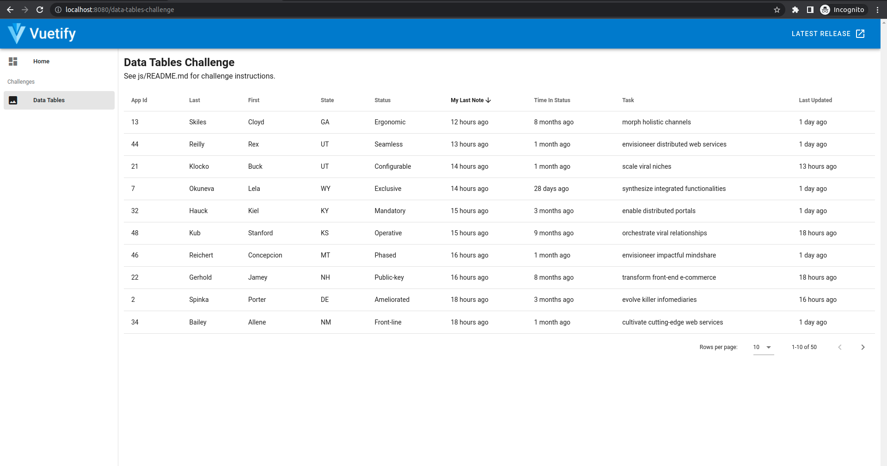
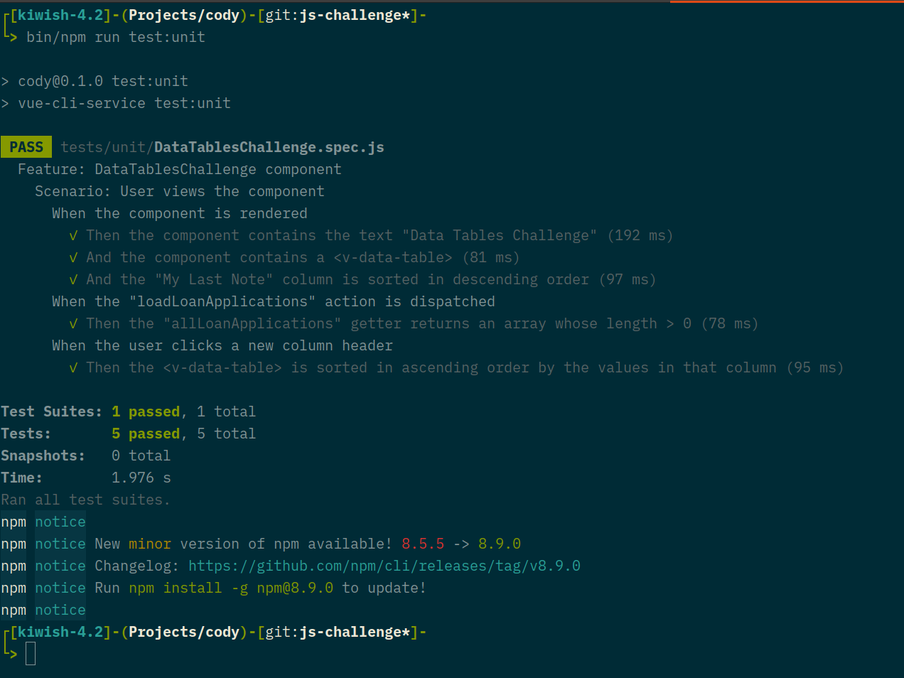

## Getting Started (JavaScript)

These instructions guide users through local machine setup for the JavaScript
coding challenge.

### Prerequisites

The only software needed to complete these coding challenges is
[Docker](https://docs.docker.com/get-docker/), a command-line shell, and a text
editor ([Atom](https://atom.io/), [VS Code](https://code.visualstudio.com/),
and [Vim](https://www.vim.org/) are a few great options). You will also need to
be connected to the internet in order to download docker images and run them for
the first time.

To ensure that Docker is installed, open a command-line shell and run `docker
run hellow-world`:

```console
$ docker run hello-world

Hello from Docker!
This message shows that your installation appears to be working correctly.

To generate this message, Docker took the following steps:
 1. The Docker client contacted the Docker daemon.
 2. The Docker daemon pulled the "hello-world" image from the Docker Hub.
    (amd64)
 3. The Docker daemon created a new container from that image which runs the
    executable that produces the output you are currently reading.
 4. The Docker daemon streamed that output to the Docker client, which sent it
    to your terminal.

To try something more ambitious, you can run an Ubuntu container with:
 $ docker run -it ubuntu bash

Share images, automate workflows, and more with a free Docker ID:
 https://hub.docker.com/

For more examples and ideas, visit:
 https://docs.docker.com/get-started/

```

### Installing

During this step, Docker will attempt to connect to the Internet and download
the image dependencies for the `node` container. After the first command,
Docker will use cached copies of the images and the commands will take less time
to run. From the project root ("cody") directory, run the following command to
ensure that the `node` container is downloaded and running properly:

```console
$ bin/node --version
v16.15.0

```

## Code Challenges

Please choose one of the code challenges below.

### 1. Data Tables

The objective of this challenge is to display a list of loan applications using
a Vuetify `<v-data-table>` component.



Begin by running the application:

```console
$ bin/npm run serve
```

To complete this challenge, please satisfy the following requirements:

1. make a GET request to the following URL to receive mock loan applications:

```
https://6271819ac455a64564b41998.mockapi.io/api/v3/applications
```

2. display the mock loan applications using Vuetify's `<v-data-table>`;
   a. the table should have the following columns (from left to right):
      1. "App Id";
      2. "Last Name";
      3. "First Name";
      4. "State";
      5. "Status";
      6. "My Last Note";
      7. "Time In Status";
      8. "Task";
      9. "Last Updated"; and
   b. format date value columns using a relative format (e.g., "18 hours ago")
      (hint: the Luxon package, which is already included in package.json, has a
      `DateTime` object which defines a `toRelative()` method that returns this
      format);
   c. by default the table should sort in descending order by "My Last Note";
   d. allow the user to sort loan applications by clicking a column header; and

3. ensure that all Jest tests covering the `DataTablesChallenge` component are
   passing.



To build the project and start a local development server:

```console
$ bin/npm run serve
```

The dev server (based on webpack-dev-server) comes with Hot-Module-Replacement
(HMR).

To run the entire Jest test suite:

```console
$ bin/npm run test:unit
```

To run the linter:

```console
$ bin/npm run lint
```

#### FAQs

Q: Do I need to install any additional JS packages?

A: No. Of course you can install additional JS packages if you'd like, but it's
possible to complete the challenge using only the installed packages.
